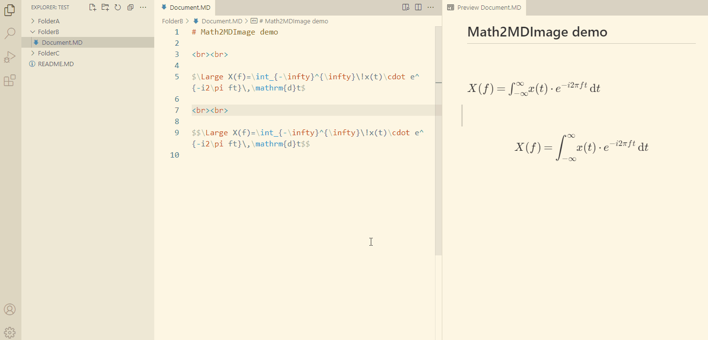

# VSCode Math2MDImage

## Description

This VS Code extension allows you to convert LaTeX math equations in your Markdown files into SVG images. Images are rendered locally with MathJax. These images will be located in `<current workspace directory>/svg/` folder. Images have white background.

To convert equation in your Markdown file into image:

1. Select the text that contains equation
   * For inline style, equation has to start and end with dollar sign (eg `$2+2=5$`)
   * For display style, equation has to start and end with two dollar signs (eg `$$2+2=5$$`)
2. Run the command `Math2MDImage » Render math to image` from context menu or command palette
3. Selected text will be commented out and generated image will be inserted bellow (see demo)

### Demo

### Why?

GitHub introduced [LaTeX math support in Markdown](https://docs.github.com/en/get-started/writing-on-github/working-with-advanced-formatting/writing-mathematical-expressions) some time ago. Sadly it lacks support for some useful LaTeX commands/environments like multi-line equations (`\begin{align}`). Using online renderers like CodeCogs works but it's risky (website can go offline). Using SVG files for math in your notes is bulletproof solution.

White background is added so images are visible on GitHub's dark background.

## Release Notes

### 0.0.1

* Initial release

### 0.0.2

* Filenames now don't contain spaces (replaced with hyphens)
* Forward slashes are always used as path separators

---

Uses [MathJax](https://github.com/mathjax/MathJax) released under [Apache-2.0 license](https://github.com/mathjax/MathJax/blob/master/LICENSE).

Inspired by [📐 **Math » Image**](https://github.com/TeamMeow/vscode-math-to-image) © [TeamMeow](https://github.com/TeamMeow). Released under the [MIT license](https://github.com/TeamMeow/vscode-math-to-image/blob/master/LICENSE).
